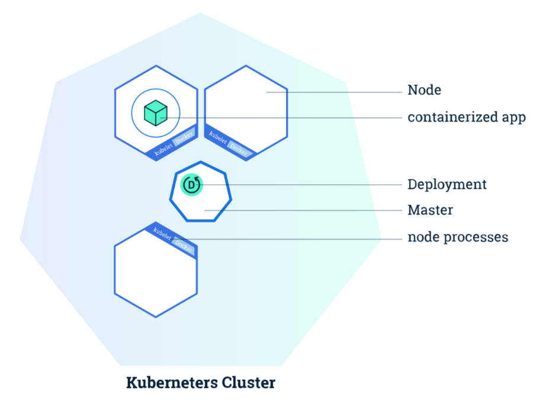
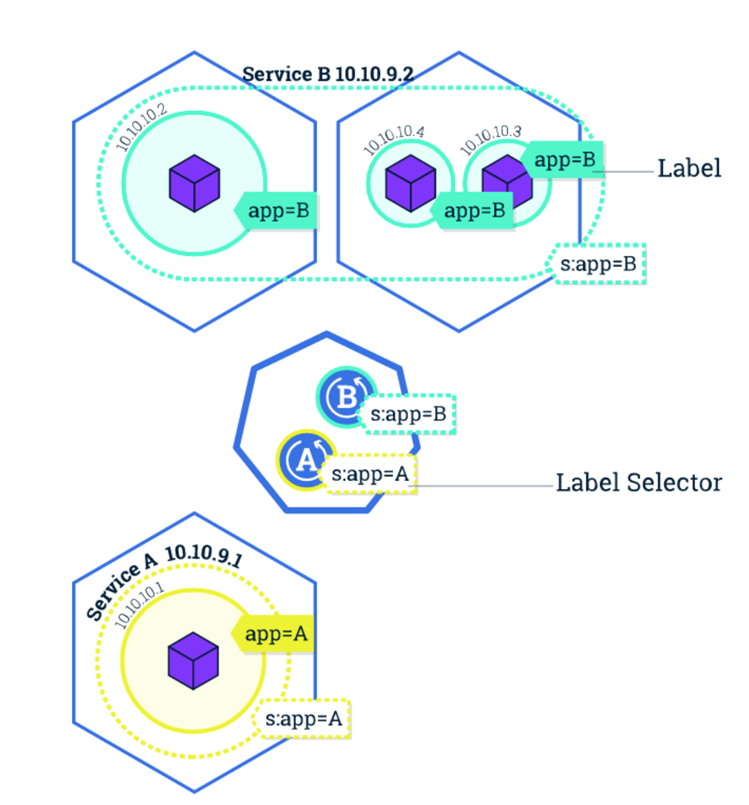
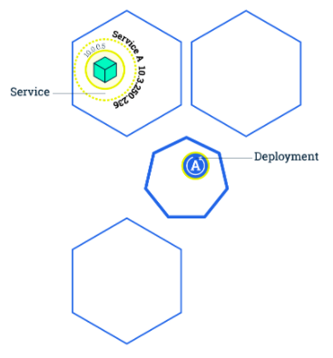
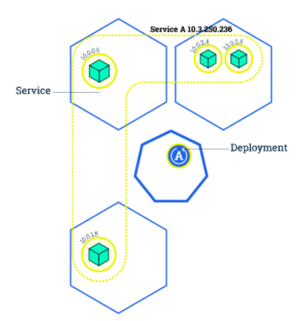
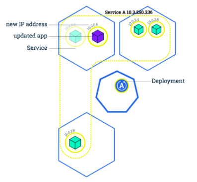
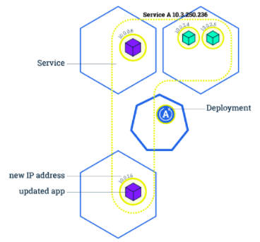
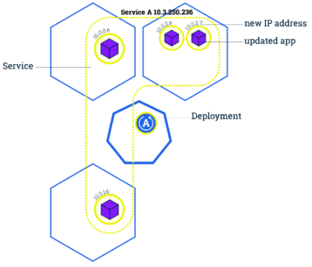

<!-- START doctoc generated TOC please keep comment here to allow auto update -->
<!-- DON'T EDIT THIS SECTION, INSTEAD RE-RUN doctoc TO UPDATE -->


- [Introduction](#introduction)
- [Kubectl command line](#kubectl-command-line)
  - [kubectl version](#kubectl-version)
  - [kubectl cluster-info](#kubectl-cluster-info)
  - [kubectl -h](#kubectl--h)
  - [kubectl command format](#kubectl-command-format)
  - [kubectl config file](#kubectl-config-file)
  - [Refereneces](#refereneces)
- [Kubernetes node](#kubernetes-node)
  - [Node information](#node-information)
  - [Node details](#node-details)
  - [Readings](#readings)
- [Kubernetes Namespace](#kubernetes-namespace)
  - [Namespaces](#namespaces)
  - [Readings](#readings-1)
- [Kubernetes Pod & Deployment](#kubernetes-pod--deployment)
  - [Create Deployment](#create-deployment)
  - [Get Deployment](#get-deployment)
  - [Get Pods](#get-pods)
  - [Get Pod Logs](#get-pod-logs)
  - [Execute command in Pod](#execute-command-in-pod)
  - [Readings](#readings-2)
- [Kubernetes Service](#kubernetes-service)
  - [Create service](#create-service)
  - [Get service](#get-service)
  - [Query service](#query-service)
  - [NodePort service](#nodeport-service)
  - [Readings](#readings-3)
- [Kubernetes Label](#kubernetes-label)
  - [View selector & label](#view-selector--label)
  - [Label operations](#label-operations)
  - [Readings](#readings-4)
- [Kubernetes Deployment Operations](#kubernetes-deployment-operations)
  - [Scale up using kubectl](#scale-up-using-kubectl)
  - [View service](#view-service)
  - [Scale down using kubectl](#scale-down-using-kubectl)
  - [Update deployment](#update-deployment)
  - [Update via setting image](#update-via-setting-image)
  - [Deployment rollout](#deployment-rollout)
- [Kubernetes Yaml/Json File](#kubernetes-yamljson-file)
  - [Get resource yaml](#get-resource-yaml)
  - [Create resource using yaml](#create-resource-using-yaml)
  - [Update resource yaml](#update-resource-yaml)
  - [Readings](#readings-5)
- [Kubernetes Events](#kubernetes-events)
- [Kubernetes Pod Lifecycle](#kubernetes-pod-lifecycle)
  - [Restart policy](#restart-policy)
  - [Container probes](#container-probes)
  - [Readings](#readings-6)
- [Kubernetes ConfigMap & Secret](#kubernetes-configmap--secret)
  - [Readings](#readings-7)
- [Summary](#summary)
- [Exercise](#exercise)

<!-- END doctoc generated TOC please keep comment here to allow auto update -->

# Introduction

本节我们将学习基于 Kubernetes 的应用管理，包括 kubectl, pod, deployment, service, label 等等。针对每个内容都会给出 Reading List。注意，本节所有的操作都基于 [Lab1](./lab1-installation.md) 中创建的 Minikube 集群。

# Kubectl command line

## kubectl version

在 kubernetes 中，我们使用 kubectl 命令与 kubernetes 交互，在下面的试验中，我们将逐渐熟悉并了解更多
kubectl 相关的命令，我们可以使用 `kubectl version` 检查 kubernetes 的版本信息。

```
$ kubectl version
Client Version: version.Info{Major:"1", Minor:"15", GitVersion:"v1.15.0", GitCommit:"e8462b5b5dc2584fdcd18e6bcfe9f1e4d970a529", GitTreeState:"clean", BuildDate:"2019-06-20T04:52:26Z", GoVersion:"go1.12.6", Compiler:"gc", Platform:"darwin/amd64"}
Server Version: version.Info{Major:"1", Minor:"15", GitVersion:"v1.15.0", GitCommit:"e8462b5b5dc2584fdcd18e6bcfe9f1e4d970a529", GitTreeState:"clean", BuildDate:"2019-06-19T16:32:14Z", GoVersion:"go1.12.5", Compiler:"gc", Platform:"linux/amd64"}
```

从以上输出可以看出，kubectl 客户端的版本是 v1.15.0，kubernetes 集群的版本是 v1.15.0。同时，该命令还会输出 kubernetes 编译信息。

## kubectl cluster-info

除了版本信息，我们还可以通过 kubectl 获取更多 kubernetes 集群的相关信息：

```
$ kubectl cluster-info
Kubernetes master is running at https://192.168.99.100:8443
KubeDNS is running at https://192.168.99.100:8443/api/v1/namespaces/kube-system/services/kube-dns:dns/proxy

To further debug and diagnose cluster problems, use 'kubectl cluster-info dump'.
```

上述信息给出了集群 API 服务的地址，如果使用 `kubectl cluster-info dump`，可以看到更多集群的信息。

## kubectl -h

kubectl 提供了非常好的帮助信息，我们可以通过 `kubectl -h` 来获取帮助信息。

```
$ kubectl -h
kubectl controls the Kubernetes cluster manager.

 Find more information at: https://kubernetes.io/docs/reference/kubectl/overview/

Basic Commands (Beginner):
  create         Create a resource from a file or from stdin.
  expose         使用 replication controller, service, deployment 或者 pod 并暴露它作为一个 新的
Kubernetes Service
  run            在集群中运行一个指定的镜像
  set            为 objects 设置一个指定的特征

Basic Commands (Intermediate):
  explain        查看资源的文档
  get            显示一个或更多 resources
  edit           在服务器上编辑一个资源
  delete         Delete resources by filenames, stdin, resources and names, or by resources and label selector

Deploy Commands:
  rollout        Manage the rollout of a resource
  scale          为 Deployment, ReplicaSet, Replication Controller 或者 Job 设置一个新的副本数量
  autoscale      自动调整一个 Deployment, ReplicaSet, 或者 ReplicationController 的副本数量

Cluster Management Commands:
  certificate    修改 certificate 资源.
  cluster-info   显示集群信息
  top            Display Resource (CPU/Memory/Storage) usage.
  cordon         标记 node 为 unschedulable
  uncordon       标记 node 为 schedulable
  drain          Drain node in preparation for maintenance
  taint          更新一个或者多个 node 上的 taints

Troubleshooting and Debugging Commands:
  describe       显示一个指定 resource 或者 group 的 resources 详情
  logs           输出容器在 pod 中的日志
  attach         Attach 到一个运行中的 container
  exec           在一个 container 中执行一个命令
  port-forward   Forward one or more local ports to a pod
  proxy          运行一个 proxy 到 Kubernetes API server
  cp             复制 files 和 directories 到 containers 和从容器中复制 files 和 directories.
  auth           Inspect authorization

Advanced Commands:
  diff           Diff live version against would-be applied version
  apply          通过文件名或标准输入流(stdin)对资源进行配置
  patch          使用 strategic merge patch 更新一个资源的 field(s)
  replace        通过 filename 或者 stdin替换一个资源
  wait           Experimental: Wait for a specific condition on one or many resources.
  convert        在不同的 API versions 转换配置文件
  kustomize      Build a kustomization target from a directory or a remote url.

Settings Commands:
  label          更新在这个资源上的 labels
  annotate       更新一个资源的注解
  completion     Output shell completion code for the specified shell (bash or zsh)

Other Commands:
  api-resources  Print the supported API resources on the server
  api-versions   Print the supported API versions on the server, in the form of "group/version"
  config         修改 kubeconfig 文件
  plugin         Provides utilities for interacting with plugins.
  version        输出 client 和 server 的版本信息

Usage:
  kubectl [flags] [options]

Use "kubectl <command> --help" for more information about a given command.
Use "kubectl options" for a list of global command-line options (applies to all commands).
```

当我们找到需要的子命令时，可以进一步使用 -h 来查看该子命令的帮助信息：

```
$ kubectl get -h
...
```

## kubectl command format

kubectl 命令的基本格式是 `kubectl <action> <resource>`，其中 `action` 可以是 `create`, `delete`, `get` 等等，`resource` 你可以使用 `kubectl api-resources` 获得完整列表。

例如，你可以通过 `kubectl get nodes` 获取节点信息，可以通过 `kubectl describe nodes ${NODENAME}` 获取节点详细信息。

## kubectl config file

kubectl 通过读取配置文件信息与 kubernetes 集群交互，默认配置文件路径是 `~/.kube/config`，内容可能如下：

```
$ cat ~/.kube/config
apiVersion: v1
clusters:
- cluster:
    certificate-authority: /Users/deyuandeng/.minikube/ca.crt
    server: https://192.168.99.100:8443
  name: minikube
contexts:
- context:
    cluster: minikube
    user: minikube
  name: minikube
current-context: minikube
kind: Config
preferences: {}
users:
- name: minikube
  user:
    client-certificate: /Users/deyuandeng/.minikube/apiserver.crt
    client-key: /Users/deyuandeng/.minikube/apiserver.key
```

这里有三个重要的顶级概念: `clusters`, `users` 和 `contexts`。

我们使用的集群名为 `minikube`，其服务器地址为 `https://192.168.99.100:8443`，其认证证书位于 `${HOME}/.minikube/ca.crt`。

当我们使用该 kubeconfig 发送请求时，我们充当用户 `minikube` (确切地说，真正的用户名来自证书通用名，但是我们暂时跳过它)。

最后，`context` 是各种配置的组合，例如，存在两个 `context`，一个用于集群 `minikube` 以及用户 `minikube`，另一个用于集群 `example` 和用户 `minikube`，即这意味着用户 `minikube` 可以同时访问 `minikube` 和 `example` 集群。

## Refereneces

* [kubectl overview](https://kubernetes.io/docs/user-guide/kubectl-overview/)

# Kubernetes node

节点（Node）是物理机或虚拟机，他们组成了 kubernetes 的资源池。Master 节点负责资源调度、集群状态控制等，
Node 节点负责运行用户应用，承接负载。我们会在后续的章节中介绍具体的架构，现在我们只关心如何通过命令行根据 kubectl 与 kubernetes
接口交互管理节点。

## Node information

在 kubernetes 中，我们可以通过 `kubectl get nodes` 命令来获取所有节点信息：

```
$ kubectl get nodes
NAME       STATUS   ROLES    AGE   VERSION
minikube   Ready    master   27h   v1.15.0
```

以上输出表明当前集群有 1 个节点。注意，我们无法完全从命令行区分 master 节点和 node 节点。这里 minikube
节点即是 master 也是 node，也就是说，minikube 主机即负责调度和管理，也负责用户容器的运行时。一般在生产环境中，我们不会在 master 上运行用户容器。但是如果主机数量非常少的情况下可以考虑，前提是预留足够的资源给 master。

不承载用户容器的主机需要加上 SchedulingDisabled 的状态（通过 `kubectl cordon <node name>` 实现），例如：

```
$ kubectl get nodes
NAME                     STATUS                     AGE
i-2ze0tfg75y5plzvnd29h   Ready,SchedulingDisabled   2d
i-2ze0woc5l1230xs5zxry   Ready                      2d
i-2ze14a3m7riw0l18oemg   Ready                      2d
i-2ze14a3m7riw0l18oemh   Ready                      2d
i-2ze1nwnt9tc3wg83rsru   Ready                      2d
```

## Node details

我们可以通过 `kubectl describe nodes` 来了解节点的详情。下面显示了 minikube 节点的详情，我们可以暂时不关心输出内容的细节。

```
$ kubectl describe nodes minikube
Name:               minikube
Roles:              master
Labels:             beta.kubernetes.io/arch=amd64
                    beta.kubernetes.io/os=linux
                    kubernetes.io/arch=amd64
                    kubernetes.io/hostname=minikube
                    kubernetes.io/os=linux
                    node-role.kubernetes.io/master=
Annotations:        kubeadm.alpha.kubernetes.io/cri-socket: /var/run/dockershim.sock
                    node.alpha.kubernetes.io/ttl: 0
                    volumes.kubernetes.io/controller-managed-attach-detach: true
CreationTimestamp:  Thu, 27 Jun 2019 11:03:46 +0800
Taints:             <none>
Unschedulable:      false
Conditions:
  Type             Status  LastHeartbeatTime                 LastTransitionTime                Reason                       Message
  ----             ------  -----------------                 ------------------                ------                       -------
  MemoryPressure   False   Fri, 28 Jun 2019 14:42:41 +0800   Thu, 27 Jun 2019 11:03:40 +0800   KubeletHasSufficientMemory   kubelet has sufficient memory available
  DiskPressure     False   Fri, 28 Jun 2019 14:42:41 +0800   Thu, 27 Jun 2019 11:03:40 +0800   KubeletHasNoDiskPressure     kubelet has no disk pressure
  PIDPressure      False   Fri, 28 Jun 2019 14:42:41 +0800   Thu, 27 Jun 2019 11:03:40 +0800   KubeletHasSufficientPID      kubelet has sufficient PID available
  Ready            True    Fri, 28 Jun 2019 14:42:41 +0800   Thu, 27 Jun 2019 11:03:40 +0800   KubeletReady                 kubelet is posting ready status
Addresses:
  InternalIP:  10.0.2.15
  Hostname:    minikube
Capacity:
 cpu:                2
 ephemeral-storage:  17784772Ki
 hugepages-2Mi:      0
 memory:             2038624Ki
 pods:               110
Allocatable:
 cpu:                2
 ephemeral-storage:  16390445849
 hugepages-2Mi:      0
 memory:             1936224Ki
 pods:               110
System Info:
 Machine ID:                 d4ca037d392045e1814f59e5c9b51c1d
 System UUID:                3EE4C717-994B-4FF3-8025-11D5E5E822CD
 Boot ID:                    6ca21b67-8cf1-430d-8a97-ddcc8dbc397b
 Kernel Version:             4.15.0
 OS Image:                   Buildroot 2018.05.3
 Operating System:           linux
 Architecture:               amd64
 Container Runtime Version:  docker://18.9.6
 Kubelet Version:            v1.15.0
 Kube-Proxy Version:         v1.15.0
Non-terminated Pods:         (15 in total)
  Namespace                  Name                                         CPU Requests  CPU Limits  Memory Requests  Memory Limits  AGE
  ---------                  ----                                         ------------  ----------  ---------------  -------------  ---
  default                    nginx-77cd46f788-bd5kk                       0 (0%)        0 (0%)      0 (0%)           0 (0%)         23h
  kube-system                coredns-5c98db65d4-5cnpp                     100m (5%)     0 (0%)      70Mi (3%)        170Mi (8%)     27h
  kube-system                coredns-5c98db65d4-brqbq                     100m (5%)     0 (0%)      70Mi (3%)        170Mi (8%)     27h
  kube-system                default-http-backend-59f7ff8999-nnzvc        20m (1%)      20m (1%)    30Mi (1%)        30Mi (1%)      27h
  kube-system                etcd-minikube                                0 (0%)        0 (0%)      0 (0%)           0 (0%)         27h
  kube-system                freshpod-v6z22                               0 (0%)        0 (0%)      0 (0%)           0 (0%)         27h
  kube-system                heapster-4d8gm                               0 (0%)        0 (0%)      0 (0%)           0 (0%)         27h
  kube-system                influxdb-grafana-9v876                       0 (0%)        0 (0%)      0 (0%)           0 (0%)         27h
  kube-system                kube-addon-manager-minikube                  5m (0%)       0 (0%)      50Mi (2%)        0 (0%)         27h
  kube-system                kube-apiserver-minikube                      250m (12%)    0 (0%)      0 (0%)           0 (0%)         27h
  kube-system                kube-controller-manager-minikube             200m (10%)    0 (0%)      0 (0%)           0 (0%)         25m
  kube-system                kube-proxy-726vx                             0 (0%)        0 (0%)      0 (0%)           0 (0%)         27h
  kube-system                kube-scheduler-minikube                      100m (5%)     0 (0%)      0 (0%)           0 (0%)         27h
  kube-system                metrics-server-84bb785897-x6rz6              0 (0%)        0 (0%)      0 (0%)           0 (0%)         27h
  kube-system                nginx-ingress-controller-7b465d9cf8-rv9k5    0 (0%)        0 (0%)      0 (0%)           0 (0%)         27h
Allocated resources:
  (Total limits may be over 100 percent, i.e., overcommitted.)
  Resource           Requests     Limits
  --------           --------     ------
  cpu                775m (38%)   20m (1%)
  memory             220Mi (11%)  370Mi (19%)
  ephemeral-storage  0 (0%)       0 (0%)
Events:
  Type    Reason                   Age                From                  Message
  ----    ------                   ----               ----                  -------
  Normal  Starting                 19h                kubelet, minikube     Starting kubelet.
  Normal  NodeHasSufficientMemory  19h (x8 over 19h)  kubelet, minikube     Node minikube status is now: NodeHasSufficientMemory
  Normal  NodeHasNoDiskPressure    19h (x8 over 19h)  kubelet, minikube     Node minikube status is now: NodeHasNoDiskPressure
  Normal  NodeHasSufficientPID     19h (x7 over 19h)  kubelet, minikube     Node minikube status is now: NodeHasSufficientPID
  Normal  NodeAllocatableEnforced  19h                kubelet, minikube     Updated Node Allocatable limit across pods
  Normal  Starting                 19h                kube-proxy, minikube  Starting kube-proxy.
  Normal  NodeAllocatableEnforced  26m                kubelet, minikube     Updated Node Allocatable limit across pods
  Normal  Starting                 26m                kubelet, minikube     Starting kubelet.
  Normal  NodeHasNoDiskPressure    26m (x8 over 26m)  kubelet, minikube     Node minikube status is now: NodeHasNoDiskPressure
  Normal  NodeHasSufficientPID     26m (x7 over 26m)  kubelet, minikube     Node minikube status is now: NodeHasSufficientPID
  Normal  NodeHasSufficientMemory  26m (x8 over 26m)  kubelet, minikube     Node minikube status is now: NodeHasSufficientMemory
  Normal  Starting                 25m                kube-proxy, minikube  Starting kube-proxy.
  Normal  NodeNotSchedulable       3m54s              kubelet, minikube     Node minikube status is now: NodeNotSchedulable
```

## Readings

* [kubernetes nodes](https://kubernetes.io/docs/concepts/architecture/nodes/)

# Kubernetes Namespace

Kubernetes namespace 是用来构建虚拟的资源池；使用 kubernetes namespace，管理员可以将 kubernetes
划分成多个虚拟的区域，不同的项目或者团队可以使用不同的 namespace，达到了共享 kubernetes 集群资源的目的。此外，
namespace 也被用来划分命名空间，即不同 namespace 里的资源可以取相同的名字，相同 namespace 内的资源不能重名。

## Namespaces

通过 `kubectl create -f`，我们可以轻松地创建一个 namespace：

```
$ kubectl create -f resources/ns.yaml
namespace "tutorial" created
```

然后通过 `kubectl get ns`，可以看到刚才创建的 namespace

```
$ kubectl get ns
NAME              STATUS   AGE
default           Active   27h
kube-node-lease   Active   27h
kube-public       Active   27h
kube-system       Active   27h
tutorial          Active   7s
```

这里 `ns` 是 `namespace` 的缩写。输出内容中的 `default`, `kube-node-lease`, `kube-public` 和 `kube-system`，都是 kubernetes
默认创建的 namespace，用来放置系统相关的资源。

```sh
$ kubectl describe ns tutorial
Name:         tutorial
Labels:       <none>
Annotations:  <none>
Status:       Active

No resource quota.

No resource limits.
```

## Readings

* [kubernetes namespace](https://kubernetes.io/docs/concepts/overview/working-with-objects/namespaces/)
* [namespace walkthrough](https://kubernetes.io/docs/tasks/administer-cluster/namespaces-walkthrough/)

# Kubernetes Pod & Deployment

当我们有一个 kubernetes 集群之后，可以开始部署应用了。在 kubernetes 的世界里，Pod 是运行应用的载体。
Pod 是由多个容器组成、是 kubernetes 的最小调度单元、Pod 共享底层资源、由 kubernetes 来管理生命周期。然而，一般情况下，我们并不直接创建 Pod，而是通过 Deployment 来创建 Pod，由 Deployment 来负责创建、更新、维护其所管理的所有 Pods。

一旦我们通过 Deployment 创建 Pod，会有一个 Deployment 控制器不断监控所有 Pod 的状态。例如，如果 Pod
运行的机器宕机了，那么 Deployment 控制器会在另一台机器上重新启动一个 Pod。接下来，我们将部署一个应用，部署之后，集群将会达到下图所示的状态。

<p align="center"></p>
<p align="center"><i>Image source: kubernetes guide</i></p><br>

这里六边形方框代表一个 kubernetes 节点，正方体代表一个 Pod。后面，我们将通过 kubectl 来管理应用。

## Create Deployment

我们可以通过 yaml 文件创建 Deployment，从而创建应用。

```
$ kubectl apply -f resources/deployment_nginx.yaml -n tutorial
deployment.apps/nginx-deployment created
```

执行该命令之后，kubernetes 在集群中寻找一台满足需求的机器运行节点，然后该节点上的 agent 启动该应用。

## Get Deployment

创建好后，我们可以通过 `kubectl get deployment` 来查看刚刚创建的 Deployment：

```
$ kubectl get deployment -n tutorial
NAME    READY   UP-TO-DATE   AVAILABLE   AGE
nginx   1/1     1            1           67s
```

从输出可以看出，我们请求创建一个 Pod (replica)，kubernetes 已经帮我们成功创建了一个。

## Get Pods

上面我们讲到，真正运行应用的载体是 Pod，Deployment 是用来管理 Pod 的资源（比如重启失败的 Pod），我们可以通过
`kubectl get pods` 来查看当前创建的 Pod。

```
$ kubectl get pods -n tutorial
NAME                     READY   STATUS    RESTARTS   AGE
nginx-646b46d648-hbwg2   1/1     Running   0          101s
```

可以看到，现在有一个 Pod 在运行中；我们可以通过 `kubectl get pods -o wide` 来查看 Pod 运行的主机，或者通过 `kubectl describe pods nginx-77cd46f788-bd5kk` 来查看 Pod 更加详细的信息（describe
中包含非常多的信息，我们将在后面介绍）。

```
$ kubectl get pods -n tutorial -o wide
NAME                     READY   STATUS    RESTARTS   AGE     IP            NODE       NOMINATED NODE   READINESS GATES
nginx-646b46d648-hbwg2   1/1     Running   0          2m23s   172.17.0.11   minikube   <none>           <none>
```

## Get Pod Logs

当我们部署要应用之后，可以通过 `kubectl logs <pod name>` 和 `kubectl exec <pod name>` 与 Pod 交互。

```
$ kubectl logs nginx-646b46d648-hbwg2 -n tutorial
```

由于没有任何请求，nginx pod 日志暂时为空。现在我们尝试访问 nginx pod。由于 `minikube` 本身是运行在虚拟机中，因此我们需要登录虚拟机访问 nginx pod (nginx pod ip: 172.17.0.11)。

```
$ minikube ssh
                         _             _
            _         _ ( )           ( )
  ___ ___  (_)  ___  (_)| |/')  _   _ | |_      __
/' _ ` _ `\| |/' _ `\| || , <  ( ) ( )| '_`\  /'__`\
| ( ) ( ) || || ( ) || || |\`\ | (_) || |_) )(  ___/
(_) (_) (_)(_)(_) (_)(_)(_) (_)`\___/'(_,__/'`\____)

# in minikube vm
$ curl 172.17.0.11
<!DOCTYPE html>
<html>
...
</html>
```

此时再查看 nginx，可以看到 nginx 的访问日志。

```
$ kubectl logs nginx-3035859230-d2sfd -n tutorial
172.17.0.1 - - [28/Jun/2019:07:03:09 +0000] "GET / HTTP/1.1" 200 612 "-" "curl/7.61.1" "-"
```

## Execute command in Pod

有时候，我们需要在 Pod 中执行命令，可以通过 `kubectl exec`：

```
$ kubectl exec nginx-646b46d648-hbwg2 -n tutorial -- ls -l
total 64
drwxr-xr-x   2 root root 4096 Dec  4  2015 bin
drwxr-xr-x   2 root root 4096 Aug 26  2015 boot
drwxr-xr-x   5 root root  360 Jun 28 06:57 dev
drwxr-xr-x   1 root root 4096 Jun 28 06:57 etc
drwxr-xr-x   2 root root 4096 Aug 26  2015 home
drwxr-xr-x   9 root root 4096 Nov 27  2014 lib
drwxr-xr-x   2 root root 4096 Dec  4  2015 lib64
drwxr-xr-x   2 root root 4096 Dec  4  2015 media
drwxr-xr-x   2 root root 4096 Dec  4  2015 mnt
drwxr-xr-x   2 root root 4096 Dec  4  2015 opt
dr-xr-xr-x 226 root root    0 Jun 28 06:57 proc
drwx------   2 root root 4096 Dec  4  2015 root
drwxr-xr-x   1 root root 4096 Jun 28 06:57 run
drwxr-xr-x   2 root root 4096 Dec  4  2015 sbin
drwxr-xr-x   2 root root 4096 Dec  4  2015 srv
dr-xr-xr-x  12 root root    0 Jun 28 06:56 sys
drwxrwxrwt   1 root root 4096 Dec  5  2015 tmp
drwxr-xr-x   1 root root 4096 Dec  5  2015 usr
drwxr-xr-x   1 root root 4096 Dec  5  2015 var
```

注意，我们通过双横线（“--”）区分本地终端命令和容器中执行的命令；当执行的命令只有一个单词的时候，可以省略。如果容器中有 `shell`，我们也可以启动一个远程终端：

```
$ kubectl exec -it nginx-646b46d648-hbwg2 -n tutorial bash
root@nginx-646b46d648-hbwg2:/# ls -l
total 64
drwxr-xr-x   2 root root 4096 Dec  4  2015 bin
drwxr-xr-x   2 root root 4096 Aug 26  2015 boot
drwxr-xr-x   5 root root  360 Jun 28 06:57 dev
drwxr-xr-x   1 root root 4096 Jun 28 06:57 etc
drwxr-xr-x   2 root root 4096 Aug 26  2015 home
drwxr-xr-x   9 root root 4096 Nov 27  2014 lib
drwxr-xr-x   2 root root 4096 Dec  4  2015 lib64
drwxr-xr-x   2 root root 4096 Dec  4  2015 media
drwxr-xr-x   2 root root 4096 Dec  4  2015 mnt
drwxr-xr-x   2 root root 4096 Dec  4  2015 opt
dr-xr-xr-x 226 root root    0 Jun 28 06:57 proc
drwx------   2 root root 4096 Dec  4  2015 root
drwxr-xr-x   1 root root 4096 Jun 28 06:57 run
drwxr-xr-x   2 root root 4096 Dec  4  2015 sbin
drwxr-xr-x   2 root root 4096 Dec  4  2015 srv
dr-xr-xr-x  12 root root    0 Jun 28 06:56 sys
drwxrwxrwt   1 root root 4096 Dec  5  2015 tmp
drwxr-xr-x   1 root root 4096 Dec  5  2015 usr
drwxr-xr-x   1 root root 4096 Dec  5  2015 var
```

使用 `ctrl + d` 可以退出远程终端。

## Readings

* [kubernetes pod](https://kubernetes.io/docs/concepts/workloads/pods/pod/)

# Kubernetes Service

接下来我们通过一连串的命令学习 kubernetes service。kubernetes service 有以下几个作用：

* 提供固定的 IP。由于 Pod 可以随时启停，Pod IP 可能随时都会变化，例如上面 nginx pod 重启之后 IP
  可能不再是 172.17.0.11。Service 为 Pods 提供的固定 IP，其他服务可以通过 Service IP 找到提供服务的
  Pods。
* 提供负载均衡。Service 由多个 Pods 组成，kubernetes 对组成 Service 的 Pods 提供的负载均衡方案，例如随机访问、基于 Client IP 的 session affinity。
* 服务发现。集群中其他服务可以通过 Service 名字访问后端服务（DNS），也可以通过环境变量访问。

下图是 kubernetes Pods, Service 的典型关系。下图有两个 Deployment: A 和 B。其中 Deployment A
创建了一个 Pods（黄色），Deployment B 创建了三个 Pod（绿色）。我们可以创建两个 Service: A 和 B。
Service A 管理由 Deployment A 创建的 Pods，Service B 管理 Deployment B 创建的 Pods。可以看到，
Service A 和 Service B 都有自己独立的 IP。无论他们所管理的容器如何变化， Service 的 IP 都不会变化。

<p align="center"> </p>
<p align="center"><i>Image source: kubernetes guide</i></p><br>

## Create service

与其他资源相同，我们可以通过 `kubectl create -f` 加文件名创建 Service。但类似 Deployment，kubernetes
提供了快捷命令让我们能快速创建 Service。

```
$ kubectl expose deployment nginx --port 80 -n tutorial
service "nginx" exposed
```

## Get service

通过 `kubectl get service` 命令可以查看 service 的详细信息：

```
$ kubectl get svc nginx -n tutorial
NAME    TYPE        CLUSTER-IP    EXTERNAL-IP   PORT(S)   AGE
nginx   ClusterIP   10.96.6.136   <none>        80/TCP    15s
```

可以看到，Service 具有一个固定的 IP 10.96.6.136。同样，通过 describe 可以看到更多详细的信息：

```
$ kubectl describe svc nginx -n tutorial
Name:              nginx
Namespace:         tutorial
Labels:            run=nginx
Annotations:       <none>
Selector:          run=nginx
Type:              ClusterIP
IP:                10.96.6.136
Port:              <unset>  80/TCP
TargetPort:        80/TCP
Endpoints:         172.17.0.11:80
Session Affinity:  None
Events:            <none>
```

其中，Endpoint 表明 Service 所选中的 PodIP:PodPort。我们可以查看 Pod 信息来验证：

```
$ kubectl get pods -o wide -n tutorial
NAME                     READY   STATUS    RESTARTS   AGE   IP            NODE       NOMINATED NODE   READINESS GATES
nginx-646b46d648-hbwg2   1/1     Running   0          14m   172.17.0.11   minikube   <none>           <none>
```

## Query service

创建 Service 后，我们可以在主机上直接访问该 Service。下面两条命令实际上访问的都是同一个后端。第一个命令通过 Service IP 访问，第二个命令通过 Pod IP 访问。

通过 Service IP 访问：

```
$ minikube ssh
$ curl 10.96.6.136
<!DOCTYPE html>
<html>
...
</html>
```

通过 Pod IP 访问：

```
$ minikube ssh
$ curl 172.17.0.11
<!DOCTYPE html>
<html>
...
</html>
```

上面的命令创建了一个名为 nginx 的 Service，并使用 80 作为服务端口。这里，我们的 nginx 容器监听的是容器的 80 端口，该端口是 Pod IP 所监听的端口；我们可以在 Service 上使用不同的端口。例如，若我们想暴露的服务端口是 8080 端口，需要使用 port 和 targetPort 选项。

首先，删除已经创建的 Service：

```
$ kubectl delete svc nginx -n tutorial
service "nginx" deleted
```

之后，创建 Service：

```
$ kubectl expose deployment nginx --port 8080 --target-port 80 -n tutorial
service "nginx" exposed
```

尝试用 8080 端口访问服务

```
$ kubectl get svc nginx -n tutorial
NAME    TYPE        CLUSTER-IP     EXTERNAL-IP   PORT(S)    AGE
nginx   ClusterIP   10.98.125.20   <none>        8080/TCP   6s

$ minikube ssh
$ curl 10.98.125.20:8080
<!DOCTYPE html>
<html>
...
</html>
```

## NodePort service

上述创建的 Service 只能被集群内部的节点和 Pod 访问，并不能被外部访问。我们可以通过两种方式暴露服务：`NodePort` 和 `LoadBalancer`。`NodePort` 通过在每个节点打开一个端口对外提供服务，`LoadBalancer` 通过创建一个外部负载均衡器（例如公有云负载均衡器）来对外提供服务。这里我们尝试使用 `NodePort`。

首先，删除已有的 Service：

```
$ kubectl delete svc nginx -n tutorial
service "nginx" deleted
```

通过 NodePort 暴露服务，注意这里使用了 `--type NodePort`：

```
$ kubectl expose deployment nginx --port 80 --type NodePort -n tutorial
service "nginx" exposed
```

查看 Service 的细节：

```
$ kubectl get svc nginx -n tutorial
NAME    TYPE       CLUSTER-IP     EXTERNAL-IP   PORT(S)        AGE
nginx   NodePort   10.107.97.57   <none>        80:32542/TCP   5s
```

```
$ kubectl describe svc nginx -n tutorial
Name:                     nginx
Namespace:                tutorial
Labels:                   run=nginx
Annotations:              <none>
Selector:                 run=nginx
Type:                     NodePort
IP:                       10.107.97.57
Port:                     <unset>  80/TCP
TargetPort:               80/TCP
NodePort:                 <unset>  32542/TCP
Endpoints:                172.17.0.11:80
Session Affinity:         None
External Traffic Policy:  Cluster
Events:                   <none>
```

从以上输出可以看到，nginx 服务打开了节点的 32542 端口（每个节点），我们可以通过 `NodeIP:NodePort` 访问服务。

```
$ curl $(minikube ip):32542
<!DOCTYPE html>
<html>
...
</html>
```

## Readings

* [kubernetes service](https://kubernetes.io/docs/concepts/services-networking/service/). Please read as much as you can, we'll come back to service again.
* [run application with service](https://kubernetes.io/docs/tasks/access-application-cluster/connecting-frontend-backend/).
* [ports in kubernetes](https://speakerdeck.com/thockin/kubernetes-a-very-brief-explanation-of-ports)

# Kubernetes Label

Service 通过 selector & label 来选取它所管理的 Pod，同样 Deployment 也是通过 selector & label
选取它所管理的 Pod。因为我们是通过 Deployment 创建的 Pod，因此 Deployment 的 selector 一定是匹配
Pod 的 label。如果我们想让 Service 选择与 Deployment 相同的 Pods，我们需要将 Service 的 selector
设为与 Deployment 相同。在上面的实验中，我们使用 `kubectl expose deployment nginx` 的时候，kubernetes
默认将 Service 的 selector 设置成与 Deployment 相同的 selector。下图对 label 做了详细的标注。

<p align="center"> </p>
<p align="center"><i>Image source: kubernetes guide</i></p><br>

由上图可以看出：

| Resource                       | selector |
| ------------------------------ | -------- |
| Deployment A, Service A, Pod A | app=A    |
| Deployment B, Service B, Pod B | app=B    |

Label 可以在创建时添加，也可以在运行时添加或修改。在运行时修改会影响集群的状态，因为现有的 selector & label
结构会被改变。

## View selector & label

从下面的输出可以看到，上述创建的 Deployment 和 Service 的 Selector 都是 `run=nginx`。Pod 具有 Label
`pod-template-hash=646b46d648,run=nginx`，因此他们都选中了 `nginx-646b46d648-hbwg2` 这个 Pod （只要
Pod label 的子集满足即可；这里的 `pod-template-hash=646b46d648` Label 是 kubernetes 自动创建）。

```
$ kubectl describe deployment nginx -n tutorial
Name:                   nginx
Namespace:              tutorial
CreationTimestamp:      Fri, 28 Jun 2019 14:56:58 +0800
Labels:                 run=nginx
Annotations:            deployment.kubernetes.io/revision: 1
Selector:               run=nginx
...
```

```
$ kubectl describe svc nginx -n tutorial
Name:                   nginx
Namespace:              tutorial
Labels:                 run=nginx
Annotations:            <none>
Selector:               run=nginx
...
```

```
$ kubectl describe pods nginx-646b46d648-hbwg2 -n tutorial
Name:           nginx-646b46d648-hbwg2
Namespace:      tutorial
Priority:       0
Node:           minikube/10.0.2.15
Start Time:     Fri, 28 Jun 2019 14:56:59 +0800
Labels:         pod-template-hash=646b46d648
                run=nginx
```

## Label operations

kubectl 支持对资源的 label 进行管理，比如我们可以通过 -l 选项查看仅具有某个 label 的资源。

```
$ kubectl get pods -l run=nginx -n tutorial
NAME                     READY   STATUS    RESTARTS   AGE
nginx-646b46d648-hbwg2   1/1     Running   0          26m
```

```
$ kubectl get svc -l run=nginx -n tutorial
NAME    TYPE       CLUSTER-IP     EXTERNAL-IP   PORT(S)        AGE
nginx   NodePort   10.107.97.57   <none>        80:32542/TCP   7m38s
```

当没有任何资源满足 label 时，输出为空：

```
$ kubectl get svc -l run=apache -n tutorial
No resources found.
```

kubectl 支持对资源的 label 进行操作，如下所示：

```
$ kubectl get pods -n tutorial
NAME                     READY   STATUS    RESTARTS   AGE
nginx-646b46d648-hbwg2   1/1     Running   0          26m

$ kubectl label pod nginx-646b46d648-hbwg2 app=v1 -n tutorial
pod/nginx-646b46d648-hbwg2 labeled

$ kubectl describe pods nginx-646b46d648-hbwg2 -n tutorial
Name:           nginx-646b46d648-hbwg2
Namespace:      tutorial
Priority:       0
Node:           minikube/10.0.2.15
Start Time:     Fri, 28 Jun 2019 14:56:59 +0800
Labels:         app=v1
                pod-template-hash=646b46d648
                run=nginx
Annotations:    <none>
Status:         Running
IP:             172.17.0.11
Controlled By:  ReplicaSet/nginx-646b46d648
```

注意这里我们是对 Pod 添加了一个 label，并不会影响 Deployment 与 Pod 之间的关系。因为 Pod 保持 Label
`run=nginx`，依然会被 Deployment 选中。

## Readings

* [label and selector](https://kubernetes.io/docs/concepts/overview/working-with-objects/labels/)

# Kubernetes Deployment Operations

## Scale up using kubectl

接下来我们将学习 kubernetes Deployment 的另外两个操作：水平扩展应用和更新应用。下图中，Deployment A
有一个 Pod 在运行，Service A 管理该 Pod。

<p align="center"></p>
<p align="center"><i>Image source: kubernetes guide</i></p><br>

通过调整 Deployment 的副本数量，我们可以将 Pod 的数量调整到 4 个。与此同时，Service 会感知到同样 label 的
Pod 被扩容到了 4 个，会将流量导到所有 Pod（而不是只有最开始的 Pod）。

<p align="center"></p>
<p align="center"><i>Image source: kubernetes guide</i></p><br>

首先创建 Deployment 和 Service（确保前面教程的 Deployment 和 Service 已经被删除）：

```
kubectl apply -f resources/deployment_nginx -n tutorial
kubectl expose deployment nginx --port 80 --name=nginx -n tutorial
```

接下来，我们可以通过 `kubectl scale` 子命令将 Pod 数量扩容到四个：

```
$ kubectl get deployments -n tutorial
NAME    READY   UP-TO-DATE   AVAILABLE   AGE
nginx   1/1     1            1           13s

$ kubectl scale deployments nginx --replicas=4 -n tutorial
deployment.extensions/nginx scaled

$ kubectl get deployments -n tutorial
NAME    READY   UP-TO-DATE   AVAILABLE   AGE
nginx   4/4     4            4           49s

$ kubectl get pods -n tutorial -o wide
NAME                    READY   STATUS    RESTARTS   AGE   IP            NODE       NOMINATED NODE   READINESS GATES
nginx-d6b94d6f6-lggxr   1/1     Running   0          28s   172.17.0.11   minikube   <none>           <none>
nginx-d6b94d6f6-lkr8m   1/1     Running   0          59s   172.17.0.8    minikube   <none>           <none>
nginx-d6b94d6f6-npntj   1/1     Running   0          28s   172.17.0.13   minikube   <none>           <none>
nginx-d6b94d6f6-rh42k   1/1     Running   0          28s   172.17.0.12   minikube   <none>           <none>
```

可以看到目前有四个 Pods，其中 `AGE` 较小的是新生成的。

## View service

之前提到，Service 会感知到 Pods 的变化，在所有的 Pods 中负载均衡，我们可以通过 kubectl 查看。

```
$ kubectl describe service nginx -n tutorial
Name:              nginx
Namespace:         tutorial
Labels:            run=nginx
Annotations:       <none>
Selector:          run=nginx
Type:              ClusterIP
IP:                10.103.221.162
Port:              <unset>  80/TCP
TargetPort:        80/TCP
Endpoints:         172.17.0.11:80,172.17.0.12:80,172.17.0.13:80 + 1 more...
Session Affinity:  None
Events:            <none>
```

Service nginx 已经将后端 Endpoints 扩容到所有的 4 个 Pods。

## Scale down using kubectl

我们也可以通过同样的命令缩容（kubectl scale）。Deployment 不会区分是扩容命令或是缩容命令，它只关心将实例的数量调整到指定的数量。

```
$ kubectl scale deployments nginx --replicas=2 -n tutorial
deployment.extensions/nginx scaled

$ kubectl get pods -n tutorial
NAME                    READY   STATUS    RESTARTS   AGE
nginx-d6b94d6f6-lkr8m   1/1     Running   0          4m58s
nginx-d6b94d6f6-rh42k   1/1     Running   0          4m27s
```

## Update deployment

接下来，我们将了解 kubernetes 如何进行应用更新。见下图，我们目前有四个运行中的应用：

<p align="center"></p>
<p align="center"><i>Image source: kubernetes guide</i></p><br>

当我们更新容器镜像时，kubernetes 会启动一个新 Pod 并关闭一个老 Pod。下图中，紫色的 Pod 为 kubernetes
新创建的 Pod，淡绿色 Pod 为老 Pod。Service 会停止向老 Pod 导流。

<p align="center"></p>
<p align="center"><i>Image source: kubernetes guide</i></p><br>

第一个 Pod 更新成功后，Deployment 会更新第二个 Pod。如下图所示，紫色两个 Pod 为 Deployment 创建的新 Pod。

<p align="center"></p>
<p align="center"><i>Image source: kubernetes guide</i></p><br>

最后，Deployment 将所有的 Pod 都更新完毕。

<p align="center"></p>
<p align="center"><i>Image source: kubernetes guide</i></p><br>

## Update via setting image

接下来，我们通过命令行了解 kubernetes 更新应用的过程。

```
$ kubectl set image deployments nginx nginx=cargo.caicloud.io/caicloud/nginx:1.9.3 -n tutorial
deployment.extensions/nginx image updated

$ kubectl get pods -n tutorial
NAME                     READY   STATUS              RESTARTS   AGE
nginx-d6b94d6f6-lkr8m    0/1     Terminating         0          5m58s
nginx-d6b94d6f6-rh42k    1/1     Running             0          5m27s
nginx-86d4667764-gxwkb   1/1     Running             0          4s
nginx-86d4667764-hr6r7   0/1     ContainerCreating   0          2s
```

过一段时间后，所有 Pod 都已经更新了：

```
$ kubectl get pods -n tutorial
NAME                     READY   STATUS    RESTARTS   AGE
nginx-86d4667764-gxwkb   1/1     Running   0          67s
nginx-86d4667764-hr6r7   1/1     Running   0          65s
```

分析一下上述命令，`kubectl set image` 将 Deployment 中的 nginx 镜像版本改为 1.9.3；运行该命令之后，发现
kubernetes 删掉了一个现有的 Pod，然后重新启动了两个新的 Pod（我们可以从一串数字中看出，"86d4667764" 是新 Pod 的 Hash 值，"d6b94d6f6" 是老 Pod 的 Hash 值）。等待一段时间后再次查询 Pods，发现所有新的 Pods 已经上线。整个过程中，我们都可以尝试去访问 nginx 服务，注意其版本的变化。

```
$ curl $(minikube ip):31658/version
<html>
...
<hr><center>nginx/1.9.3</center>
</html>
```

其中 31658 是 Service 暴露的 NodePort 端口。

## Deployment rollout

rollout 子命令可以用来查询部署的状态，以及回滚等操作。使用 `kubectl rollout status` 可以查询部署的状态。

```
$ kubectl rollout status deployment nginx -n tutorial
deployment "nginx" successfully rolled out
```

上面的状态说明之前部署的 Deployment 已经正常部署了。如果我们想要回滚到之前的版本，可以使用
`kubectl rollout undo` 命令。

首先，当前 nginx 处于 1.9.3 版本：

```
$ curl $(minikube ip):31658/version
<html>
...
<hr><center>nginx/1.9.3</center>
</body>
</html>
```

接下来使用回滚操作：

```
$ kubectl rollout undo deployment nginx -n tutorial
deployment.extensions/nginx rolled back

$ kubectl get pods -n tutorial
NAME                     READY   STATUS    RESTARTS   AGE
nginx-646b46d648-7c457   1/1     Running   0          9s
nginx-646b46d648-9wpdp   1/1     Running   0          6s
```

使用 rollout undo 之后，nginx 的版本回到了 set image 之前的版本：

```
$ curl $(minikube ip):31658/version
<html>
...
<hr><center>nginx/1.9.7</center>
</body>
</html>
```

# Kubernetes Yaml/Json File

在 Kubernetes 101 实验中，我们都是通过 kubectl 提供的快捷命令来创建、管理资源。实际上，对于 kubernetes
而言，所有的操作都是以 yaml 文件为主。我们之前所使用的命令，只是方便用户快速修改 yaml 中经常需要修改的字段。接下来，我们学习 kubernetes yaml/json 文件格式和使用方法。首先，kubernetes yaml 文件的基本格式如下代码所示（这里展示的是一个 Pod 的 yaml 文件，并且有部分裁剪）。kubernetes yaml 整体分为 5 个部分：apiVersion,
kind, metadata, spec, status；其中 apiVersion 表明当前 kubernetes API 的分组；kind 表明当前操作的资源类型；
metadata 是资源的元数据，对于每种资源都是固定的，例如资源的名字，所处的 namespace, label 等；spec
是用户对资源的 “说明书”，即用户对资源的各种配置信息；status 是资源当前的状态，kubernetes 会尽最大努力使
spec 和 status 相匹配。

```yaml
apiVersion: v1
kind: Pod
metadata:
  creationTimestamp: "2019-06-28T08:16:45Z"
  generateName: nginx-646b46d648-
  labels:
  name: nginx-646b46d648-7c457
  namespace: tutorial
  ownerReferences:
  resourceVersion: "28549"
  selfLink: /api/v1/namespaces/tutorial/pods/nginx-646b46d648-7c457
  uid: e4312b93-9570-45a9-b981-8b26644f096c
spec:
  containers:
  dnsPolicy: ClusterFirst
  enableServiceLinks: true
  nodeName: minikube
  priority: 0
  restartPolicy: Always
  schedulerName: default-scheduler
  securityContext: {}
  serviceAccount: default
  serviceAccountName: default
  terminationGracePeriodSeconds: 30
  tolerations:
  volumes:
status:
  conditions:
  containerStatuses:
  hostIP: 10.0.2.15
  phase: Running
  podIP: 172.17.0.8
  qosClass: Burstable
  startTime: "2019-06-28T08:16:46Z"
```

接下来我们学习使用 yaml 文件。

## Get resource yaml

用户可以通过 kubectl get <resource> <name> -o yaml 来获取已经部署的资源的 Yaml 文件，我们可以尝试获取之前通过
`kubectl apply`, `kubectl expose` 等命令部署的 Deployment 和 Service。

```yaml
$ kubectl get pods nginx-646b46d648-7c457 -n tutorial -o yaml
apiVersion: v1
kind: Pod
metadata:
  creationTimestamp: "2019-06-28T08:16:45Z"
  generateName: nginx-646b46d648-
...
spec:
  containers:
  - image: cargo.caicloud.io/caicloud/nginx:1.9.7
    imagePullPolicy: IfNotPresent
    name: nginx
    resources:
      limits:
        cpu: 200m
        memory: 512Mi
      requests:
        cpu: 100m
        memory: 256Mi
...
status:
  hostIP: 10.0.2.15
  phase: Running
  podIP: 172.17.0.8
  qosClass: Burstable
  startTime: "2019-06-28T08:16:46Z"
...
```

```yaml
$ kubectl get svc nginx -n tutorial -o yaml
apiVersion: v1
kind: Service
metadata:
  creationTimestamp: "2019-06-28T08:13:20Z"
  labels:
    run: nginx
  name: nginx
  namespace: tutorial
  resourceVersion: "28252"
  selfLink: /api/v1/namespaces/tutorial/services/nginx
  uid: 4586f1da-59bf-4c9c-90fb-1d4974a0e04e
spec:
  clusterIP: 10.103.177.222
  externalTrafficPolicy: Cluster
  ports:
  - nodePort: 31658
    port: 80
    protocol: TCP
    targetPort: 80
  selector:
    run: nginx
  sessionAffinity: None
  type: NodePort
status:
  loadBalancer: {}
```

## Create resource using yaml

用户可通过 kubectl create -f <file-name> 创建 kubernetes 资源。用户不需要填入更多的信息，所有信息都已经在
yaml 文件中。我们在 101 中已经通过 yaml 文件创建过 namespace。这里我们创建一个 Pod。

```
$ kubectl create -f resources/pod.yaml -n tutorial
pod "nginx" created

$ kubectl get pods -n tutorial
NAME                     READY   STATUS    RESTARTS   AGE
nginx                    1/1     Running   0          6s
nginx-646b46d648-7c457   1/1     Running   0          9m3s
nginx-646b46d648-9wpdp   1/1     Running   0          9m
```

## Update resource yaml

创建应用之后，我们可以使用 kubectl 更新 yaml 文件并将更新返回给 kubernetes。

```
# Change image from 1.9.3 to 1.9.7
$ vim resources/pod.yaml

$ kubectl apply -f resources/pod.yaml -n tutorial
Warning: kubectl apply should be used on resource created by either kubectl create --save-config or kubectl apply
pod/nginx configured
```

更新后查询更新结果：

```
$ kubectl get pods -n tutorial
NAME                     READY   STATUS    RESTARTS   AGE
nginx                    1/1     Running   1          77s
nginx-646b46d648-7c457   1/1     Running   0          10m
nginx-646b46d648-9wpdp   1/1     Running   0          10m
```

```
$ kubectl describe pods nginx -n tutorial | grep "Image:" -C 5
Status:       Running
IP:           172.17.0.11
Containers:
  nginx:
    Container ID:   docker://c3609cd17db682f38434502b23442cfac7c8defa4390b44e90139df0563d7979
    Image:          cargo.caicloud.io/caicloud/nginx:1.9.7
    Image ID:       docker-pullable://cargo.caicloud.io/caicloud/nginx@sha256:d33ae7b1dc9326bcaa91febdf37a8ea1a7340f7d6da0e2fde365a89a11201c62
    Port:           <none>
    Host Port:      <none>
    State:          Running
      Started:      Fri, 28 Jun 2019 16:26:40 +0800
```

注意镜像已经修改为 1.9.7。kubernetes 同时支持在线编辑 yaml 文件：

```
$ kubectl get pods -n tutorial
NAME                     READY   STATUS    RESTARTS   AGE
nginx                    1/1     Running   1          113s
nginx-646b46d648-7c457   1/1     Running   0          10m
nginx-646b46d648-9wpdp   1/1     Running   0          10m

# Change image from 1.9.7 to 1.9.3
$ kubectl edit pods nginx -n tutorial
pod "nginx" edited
```

同样，镜像被修改为 1.9.3。

```
$ kubectl describe pods nginx -n tutorial | grep "Image:" -C 5
Status:       Running
IP:           172.17.0.11
Containers:
  nginx:
    Container ID:   docker://dc044ead5de8eb126a59c44d4477d68fb17ff0836318d5bcc3bbac0b699af44f
    Image:          cargo.caicloud.io/caicloud/nginx:1.9.3
    Image ID:       docker-pullable://cargo.caicloud.io/caicloud/nginx@sha256:ece399fcec0b3d8afa3a5abbe85e965a1f22c5f36a788396b86b541eb7e714a8
    Port:           <none>
    Host Port:      <none>
    State:          Running
      Started:      Fri, 28 Jun 2019 16:28:21 +0800
```

## Readings

* [kubernetes deployment](https://kubernetes.io/docs/concepts/workloads/controllers/deployment/)
* [run application with deployment](https://kubernetes.io/docs/tasks/run-application/run-stateless-application-deployment/)

# Kubernetes Events

Kubernetes events 显示了 kubernetes 集群中所有的事件。不同于其他资源，kubernetes events 并不是由用户创建的资源，而是由 kubernetes 系统组件创建，用以提示用户集群发生的各种事件。我们可以通过 kubectl get 命令来查询集群的事件。默认情况下，event 会有 TTL，超过 TTL 之后 kubernetes 会将事件删掉。

```
$ kubectl get events -n tutorial
LAST SEEN   TYPE     REASON              OBJECT                        MESSAGE
12m         Normal   Scheduled           pod/nginx-646b46d648-7c457    Successfully assigned tutorial/nginx-646b46d648-7c457 to minikube
12m         Normal   Pulled              pod/nginx-646b46d648-7c457    Container image "cargo.caicloud.io/caicloud/nginx:1.9.7" already present on machine
12m         Normal   Created             pod/nginx-646b46d648-7c457    Created container nginx
12m         Normal   Started             pod/nginx-646b46d648-7c457    Started container nginx
50m         Normal   Scheduled           pod/nginx-646b46d648-8kbk9    Successfully assigned tutorial/nginx-646b46d648-8kbk9 to minikube
50m         Normal   Pulled              pod/nginx-646b46d648-8kbk9    Container image "cargo.caicloud.io/caicloud/nginx:1.9.7" already present on machine
50m         Normal   Created             pod/nginx-646b46d648-8kbk9    Created container nginx
50m         Normal   Started             pod/nginx-646b46d648-8kbk9    Started container nginx
49m         Normal   Killing             pod/nginx-646b46d648-8kbk9    Stopping container nginx
...
```

Event 与资源是相联系的，因此单独查询 Event 并不是非常有用，我们可以通过获取资源的详细信息来查看 Event 信息。例如，
`kubectl describe pod <pod name>` 会返回 Pod 的 event 信息。

```
$ kubectl describe pod nginx -n tutorial
Name:         nginx
Namespace:    tutorial
Priority:     0
Node:         minikube/10.0.2.15
Start Time:   Fri, 28 Jun 2019 16:25:42 +0800
Labels:       <none>
...
Events:
  Type    Reason     Age                   From               Message
  ----    ------     ----                  ----               -------
  Normal  Scheduled  4m20s                 default-scheduler  Successfully assigned tutorial/nginx to minikube
  Normal  Pulled     3m22s                 kubelet, minikube  Container image "cargo.caicloud.io/caicloud/nginx:1.9.7" already present on machine
  Normal  Pulled     101s (x2 over 4m19s)  kubelet, minikube  Container image "cargo.caicloud.io/caicloud/nginx:1.9.3" already present on machine
  Normal  Created    101s (x3 over 4m19s)  kubelet, minikube  Created container nginx
  Normal  Started    101s (x3 over 4m18s)  kubelet, minikube  Started container nginx
  Normal  Killing    101s (x2 over 3m23s)  kubelet, minikube  Container nginx definition changed, will be restarted
```

# Kubernetes Pod Lifecycle

Pod 生命周期主要包括：

* Pod Phase
* Pod Condition
* Restart Policy
* Container probes

用户可以通过 `kubectl describe pods` 查看以上所有信息。Pod Phase 和 Pod Condition 比较简单，我们可以实时看到
kubernetes 的反馈。这里我们主要实践 Restart Policy 和 Container probes。

## Restart policy

Restart Policy 指定当 Pod 内容器出错或执行完毕后，是否重启。下面的 Pod 使用了 debian 镜像，该镜像并不会长期运行，因此如果我们直接创建，kubernetes 会认为 Pod 出错。

```
$ kubectl create -f resources/debian.yaml -n tutorial
pod/debian created
```

注，若提示资源不足，可以删掉现有的 Deployment 或 Pod 资源。创建之后，等待 kubernetes 拉取镜像。几分钟后，
kubernetes 提示 redis-django 进入 Crash 状态，且有多次重启：

```
$ kubectl get pods -n tutorial
NAME                     READY   STATUS             RESTARTS   AGE
debian                   0/1     CrashLoopBackOff   1          32s
nginx                    1/1     Running            2          14m
nginx-646b46d648-7c457   1/1     Running            0          23m
nginx-646b46d648-9wpdp   1/1     Running            0          23m
```

现在，我们为该 Pod 添加 Restart Policy，使 kubernetes 不再不断重启 debian 容器，从而得到以下结果：

```
$ kubectl delete pods debian -n tutorial
pod "debian" deleted

$ kubectl create -f resources/debian_never_restart.yaml -n tutorial
pod "debian" created
```

debian 容器变成 `Completed` 状态：

```
$ kubectl get pods -n tutorial
NAME                     READY   STATUS      RESTARTS   AGE
debian                   0/1     Completed   0          33s
nginx                    1/1     Running     2          15m
nginx-646b46d648-7c457   1/1     Running     0          24m
nginx-646b46d648-9wpdp   1/1     Running     0          24m
```

## Container probes

Container probes 分为两种：LivenessProbe 和 ReadinessProbe。Liveness 检查应用是否依然健康无错，若有错，则
kubernetes 会根据 policy 重启或仅更新状态。ReadinessCheck 检查应用是否可以对外提供服务，若应用 Readiness
检查不通过，则 kubernetes 会将 Pod 从服务池中剔除。两者的使用方法都相同，这里我们来看看 Container probes。

打开 [pod_health.yaml](./resources/pod_health.yaml)，可以看到里面定义了 livenessProbe。当我们运行创建该 Pod 的时候，kubernetes
就开始为我们监控该 Pod 的 liveness 信息。

```
$ kubectl delete pods nginx -n tutorial
pod "nginx" deleted

$ kubectl create -f resources/pod_health.yaml -n tutorial
pod "nginx" created
```

Pod 会一直处于 Running 状态：

```
$ kubectl get pods -n tutorial
NAME                     READY     STATUS    RESTARTS   AGE
nginx                    1/1     Running     0          7s
nginx-646b46d648-7c457   1/1     Running     0          29m
nginx-646b46d648-9wpdp   1/1     Running     0          29m
```

我们可以分别尝试将 livenessProbe 的 http 80 端口改为 8080，观察 Pod 的状态。

```
$ kubectl delete pods nginx -n tutorial
pod "nginx" deleted

$ kubectl create -f resources/pod_unhealth.yaml -n tutorial
pod "nginx" created
```

Pod 会首先处于 Running 状态，但是在经过一段时间之后，Pod 会变为 Crash 状态，事件里会汇报健康检查错误：

```
$ kubectl describe pod nginx -n tutorial
Name:         nginx
Namespace:    tutorial
Priority:     0
Node:         minikube/10.0.2.15
Start Time:   Fri, 28 Jun 2019 16:46:22 +0800
Labels:       app=nginx
Annotations:  <none>
Status:       Running
IP:           172.17.0.11
Containers:
  nginx:
    ...
    Liveness:     http-get http://:8080/ delay=5s timeout=1s period=5s #success=1 #failure=3
...
Events:
  Type     Reason     Age              From               Message
  ----     ------     ----             ----               -------
  Normal   Scheduled  14s              default-scheduler  Successfully assigned tutorial/nginx to minikube
  Normal   Pulled     13s              kubelet, minikube  Container image "cargo.caicloud.io/caicloud/nginx:1.9.7" already present on machine
  Normal   Created    13s              kubelet, minikube  Created container nginx
  Normal   Started    13s              kubelet, minikube  Started container nginx
  Warning  Unhealthy  3s (x2 over 8s)  kubelet, minikube  Liveness probe failed: Get http://172.17.0.11:8080/: dial tcp 172.17.0.11:8080: connect: connection refused
```

## Readings

* [kubernetes lifecycle](https://kubernetes.io/docs/concepts/workloads/pods/pod-lifecycle/)
* [define probes](https://kubernetes.io/docs/tasks/configure-pod-container/configure-liveness-readiness-probes/)

# Kubernetes ConfigMap & Secret

ConfigMap 是 kubernetes 用来管理配置信息的资源类型。我们通过单独创建 ConfigMap，再将 ConfigMap 挂载到
Pod 内的方式分离配置和应用。我们通过一个实验来学习如何正确使用 ConfigMap。

创建 ConfigMap 可以通过 yaml 文件，也可以从文件直接创建。通过 yaml 文件的方式与创建其他资源类似。这里，我们采用文件的方式。在 `resources` 目录下，有两个文件：[game.properties](./resources/game.properties) 和 [ui.properties](./resources/ui.properties)。我们通过
kubectl 命令创建：

```
$ kubectl create configmap game-config --from-file=resources/game.properties --from-file=resources/ui.properties -n tutorial
configmap/game-config created
```

创建之后，通过 kubectl get configmap 来查看创建的 ConfigMap：

```
$ kubectl get configmap game-config -o wide -n tutorial
NAME          DATA      AGE
game-config   2         2m
```

```
$ kubectl describe configmap game-config -n tutorial
Name:         game-config
Namespace:    tutorial
Labels:       <none>
Annotations:  <none>

Data
====
game.properties:
----
enemies=aliens
lives=3
enemies.cheat=true
enemies.cheat.level=noGoodRotten
secret.code.passphrase=UUDDLRLRBABAS
secret.code.allowed=true
secret.code.lives=30
ui.properties:
----
color.good=purple
color.bad=yellow
allow.textmode=true
how.nice.to.look=fairlyNice
Events:  <none>
```

查看详情：

```
$ kubectl get configmap game-config -o yaml -n tutorial
apiVersion: v1
data:
  game.properties: |-
    enemies=aliens
    lives=3
    enemies.cheat=true
    enemies.cheat.level=noGoodRotten
    secret.code.passphrase=UUDDLRLRBABAS
    secret.code.allowed=true
    secret.code.lives=30
  ui.properties: |-
    color.good=purple
    color.bad=yellow
    allow.textmode=true
    how.nice.to.look=fairlyNice
kind: ConfigMap
metadata:
  creationTimestamp: "2019-06-28T08:49:20Z"
  name: game-config
  namespace: tutorial
  resourceVersion: "31335"
  selfLink: /api/v1/namespaces/tutorial/configmaps/game-config
  uid: 134781b7-5565-4037-b0b2-be42767255a0
```

创建 ConfigMap 之后，我们可以创建 Pod 来使用该 ConfigMap：

```
$ kubectl create -f resources/pod_configmap.yaml -n tutorial
pod/pod-configmap created
```

查看：

```
$ kubectl get pods -n tutorial
NAME                     READY     STATUS             RESTARTS   AGE
pod-configmap            0/1       Completed          0          2m

$ kubectl logs pod-configmap -n tutorial
enemies=aliens
lives=3
enemies.cheat=true
enemies.cheat.level=noGoodRotten
secret.code.passphrase=UUDDLRLRBABAS
secret.code.allowed=true
secret.code.lives=30color.good=purple
color.bad=yellow
allow.textmode=true
how.nice.to.look=fairlyNice
```

这里我们看到了通过挂载文件的方式使用 configmap，kubernetes 同时也支持通过环境变量的方式使用 configmap。此外，Secret 的使用方式与 Configmap 类似，但内容会被加密。

## Readings

* [kubernetes configmap](https://kubernetes.io/docs/tasks/configure-pod-container/configure-pod-configmap/)
* [distribute secret](https://kubernetes.io/docs/tasks/inject-data-application/distribute-credentials-secure/)


# Summary

本节介绍了 Kubernetes deployment 的更多操作, Yaml 文件规范，事件，Pod 生命周期等，接下来会介绍其他应用相关模块，存储。为确保已经掌握上面知识，请思考下面的问题。

目前为止简单介绍了 Kubernetes command line, Pod, Deployment, Service 和 Label。这些都是 kubernetes
中最为核心的概念，接下来我们将深入了解 Deployment 的功能，然后开始涉及其他模块。本节暂无实验内容。

# Exercise

以下问题是在 kubernetes 使用或运维中较常使用的命令或方式方法。

1. 学习 kubectl proxy 命令及其含义。回答如何通过 proxy 访问 kubernetes 集群？
1. 学习 kubectl port-forward 命令及其含义。回答如何通过 port-forward 访问应用？
1. 修改 Pod label 使其与 Deployment 不相符，集群有什么变化？
1. 进一步学习 kubectl rollout。回答如何通过 kubectl rollout 将应用回滚到指定版本？
1. Pod LivenessProbe 实验中，检查方式采用的是 http 模式。回答如何使用 exec 进行健康检查？请写出 yaml 文件。
1. 进一步学习 Pod Lifecycle。回答如何使用 PostStart Hook？请写出 yaml 文件。
1. 登录宿主机，使用 docker ps 查看 Pod，如何理解 docker ps 输出？
1. 学习使用 Secret，然后创建一个 Secret 并在 Pod 内访问。请写出 secret 和 pod 的 yaml 文件。
1. ConfigMap 实验中，我们采用文件加载的方式使用 ConfigMap。请写出利用环境变量加载 configmap 的例子。
