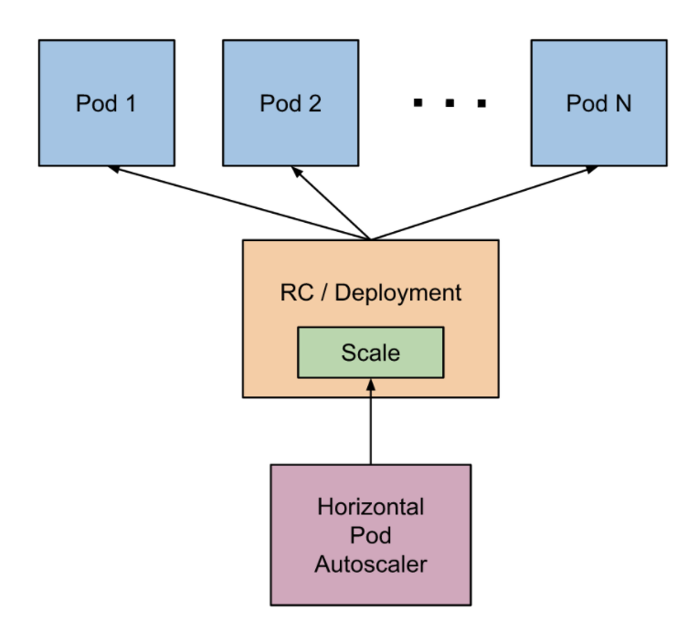

<!-- START doctoc generated TOC please keep comment here to allow auto update -->
<!-- DON'T EDIT THIS SECTION, INSTEAD RE-RUN doctoc TO UPDATE -->
**Table of Contents**  *generated with [DocToc](https://github.com/thlorenz/doctoc)*

- [Introduction](#introduction)
- [Kubernetes Job](#kubernetes-job)
  - [Using Job](#using-job)
  - [Readings](#readings)
- [Kubernetes CronJob](#kubernetes-cronjob)
  - [Using CronJob](#using-cronjob)
  - [Readings](#readings-1)
- [Kubernetes Daemonset](#kubernetes-daemonset)
  - [Using Daemonset](#using-daemonset)
  - [Readings](#readings-2)
- [Resource quota](#resource-quota)
  - [Using Resource quota](#using-resource-quota)
  - [Readings](#readings-3)
- [Kubernetes Horizontal Pod Autoscaler](#kubernetes-horizontal-pod-autoscaler)
  - [Using HPA](#using-hpa)
  - [Readings](#readings-4)
- [Kubernetes Volume](#kubernetes-volume)
  - [Using volume](#using-volume)
  - [Readings](#readings-5)
- [Kubernetes PV & PVC](#kubernetes-pv--pvc)
  - [Using PV & PVC](#using-pv--pvc)
  - [Readings](#readings-6)
- [Kubernetes StorageClass](#kubernetes-storageclass)
  - [Using StorageClass](#using-storageclass)
  - [Default StorageClass](#default-storageclass)
  - [StorageClass Provisioner](#storageclass-provisioner)
  - [Readings](#readings-7)
- [Exercise](#exercise)

<!-- END doctoc generated TOC please keep comment here to allow auto update -->

# Introduction

本节我们将了解更多 kubernetes 的概念，主要包括水平扩容和存储模型。

# Kubernetes Job

## Using Job

Kubernetes Job 通过创建 Pod 来批量执行一次性任务；不同于单独跑一个 Bare Pod，由 Job 运行起来的 Pod 在机器故障等问题下会重新调度 Pod，因此更加健壮。

下面，我们通过创建一个 Pod 来感受一下 Job 的使用：

```sh
$ kubectl create -f resources/job.yaml
job "pi" created

$ kubectl get job
NAME   COMPLETIONS   DURATION   AGE
pi     1/5           29s        29s

$ kubectl get pods -l job-name=pi
NAME       READY   STATUS      RESTARTS   AGE
pi-76h5p   1/1     Running     0          12s
pi-fhww6   0/1     Completed   0          36s
```

一段时间之后，Pod 全部运行结束，我们可以通过 `kubectl get pods` 查看：

```sh
$ kubectl get pods -l job-name=pi
NAME       READY   STATUS      RESTARTS   AGE
pi-6lgqw   0/1     Completed   0          45s
pi-76h5p   0/1     Completed   0          68s
pi-fhww6   0/1     Completed   0          92s
pi-mf96j   0/1     Completed   0          2m17s
pi-w9v4l   0/1     Completed   0          115s

$ kubectl get job
NAME   COMPLETIONS   DURATION   AGE
pi     5/5           117s       3m8s
```

观察上述 Pod 的 AGE 列，可以发现 Job 内的 Pod 都是依次运行的（总共 5 个 Pod）。Job 支持并发运行等多种控制，我们在后续任务中实现。

Job 运行完之后，删除 Job 会将所有运行结束的 Pods 也同时删掉。

```sh
$ kubectl delete job pi
job "pi" deleted

$ kubectl get pods -l job-name=pi
No resources found.
```

## Readings

* [kubernetes job](https://kubernetes.io/docs/concepts/workloads/controllers/jobs-run-to-completion/)

# Kubernetes CronJob

## Using CronJob

Kubernetes CronJob 即定时任务，就类似于 Linux 的 crontab，在指定的时间周期运行指定的作业。

这里我们通过 kubectl create 创建一个 CronJob：

```sh
$ kubectl create -f resources/cronjob.yaml
cronjob.batch/hello created
```

另外，你也可以用 kubectl run 来创建一个 CronJob：

`kubectl run hello --schedule="*/1 * * * *" --restart=OnFailure --image=cargo.caicloud.io/caicloud/busybox:latest -- /bin/sh -c "date; echo Hello from the Kubernetes cluster"`

查看 CronJob：

```sh
$ kubectl get cronjob
NAME    SCHEDULE      SUSPEND   ACTIVE   LAST SCHEDULE   AGE
hello   */1 * * * *   False     0        57s             69m
$ kubectl get jobs
NAME               COMPLETIONS   DURATION   AGE
hello-1566286260   1/1           11s        46s
```

删除 CronJob：

```sh
# 删除 CronJob 会删除它创建的所有 job 和 pod，并停止正在创建的 job
$ kubectl delete cronjob hello
cronjob.batch "hello" deleted
```

## Readings

* [kubernetes cronjob](https://kubernetes.io/docs/concepts/workloads/controllers/cron-jobs/)

# Kubernetes Daemonset

## Using Daemonset

DaemonSet 默认在每台主机上运行 Pod，典型的场景包括日志收集、存储进程等。这里，我们通过 kubectl create
来创建一个 DaemonSet：

```sh
$ kubectl create -f resources/daemonset.yaml
daemonset "ds-nginx" created

$ kubectl get ds
NAME       DESIRED   CURRENT   READY   UP-TO-DATE   AVAILABLE   NODE SELECTOR   AGE
ds-nginx   1         1         1       1            1           <none>          4s

$ kubectl get pods
NAME             READY     STATUS    RESTARTS   AGE
ds-nginx-hnndc   1/1       Running   0          8s
```

可以看到，minikube 节点都运行了一个 DaemonSet。由于目前只有一个节点，很难观测到效果，但当我们向集群中增加新的节点，
DaemonSet 会自动在新的节点中启动 Pod。

我们可以通过 kubectl delete 删除 DaemonSet：

```sh
$ kubectl delete daemonset ds-nginx
daemonset.extensions "ds-nginx" deleted
```

DaemonSet 相对于其他控制器（Deployment, Job 等）有几个特点：

**由 DaemonSet controller 调度 (1.12 以前)**：

* DaemonSet controller 创建 pod 时会将指定 nodeName（.spec.nodeName），所以 scheduler 会忽视它。因此：
  * 即使调度器没有启动，DaemonSet 的 pod 也会运行
  * 即时一个节点被标记为不可调度，由 DaemonSet 启动的容器也会运行在某个节点上
* DaemonSet 启动的 Pod 会无视优先级

**由 default scheduler 调度（从 1.12 开始默认开启）**：

* DaemonSet controller 通过给 pod 添加 NodeAffinity，然后 default scheduler 将其绑定到目标节点，即指定 nodeName（.spec.nodeName）

## Readings

* [kubernetes daemonset](https://kubernetes.io/docs/concepts/workloads/controllers/daemonset/)

# Resource quota

默认情况下，namespace 只提供名字的隔离，并没有提供资源的限制（Quota）。也就是说一个 namespace
的用户可以创建任意多的资源，直到将集群的所有资源用光。为了解决这个问题，我们可以通过创建 ResourceQuota
资源来限制某个 namespace 可以使用的资源量，即：

- 计算资源，包括 cpu 和 memory
  - cpu, limits.cpu, requests.cpu
  - memory, limits.memory, requests.memory
- 存储资源，包括存储资源的总量以及指定 storage class 的总量
  - requests.storage：存储资源总量，如 500Gi
  - persistentvolumeclaims：pvc 的个数
  - .storageclass.storage.k8s.io/requests.storage
  - .storageclass.storage.k8s.io/persistentvolumeclaims
  - requests.ephemeral-storage 和 limits.ephemeral-storage （需要 v1.8+）
- 对象数量，即可创建的对象的个数
  - pods, replicationcontrollers, configmaps, secrets
  - resourcequotas, persistentvolumeclaims
  - services, services.loadbalancers, services.nodeports
  - custom resources (需要 v1.15+)

## Using Resource quota

我们可以通过 `kubectl create -f` 创建 ResourceQuota，该 quota 限制了 tutorial namespace
只能请求 1 个 CPU 和 1Gi 内存，最多只能使用 2 个 CPU 和 2Gi 内存。这里，请求指的是 kubernetes
在调度时容器时会寻找至少有 1 个 CPU 和 1Gi 内存的节点。最多使用指的是当容器可以使用超过其请求的 1 个 CPU
数量，但是一定不可能超过 2 个 CPU。kubernetes 的这个设计目的是提供更加灵活的资源模型，支持超卖。

```sh
# 这里用到了前面 lab 创建的 namespace tutorial，若已删除，需重新创建
$ kubectl create namespace tutorial
namespace/tutorial created

$ kubectl create -f resources/quota.yaml
resourcequota/tutorial-quota created
```

查看 ResourceQuota 细节：

```sh
$ kubectl describe quota -n tutorial
Name:            tutorial-quota
Namespace:       tutorial
Resource         Used    Hard
--------         ----    ----
limits.cpu       500m    2
limits.memory    1124Mi  2Gi
requests.cpu     300m    1
requests.memory  612Mi   1Gi
```

如果我们尝试在 tutorial namespace 下创建超过配额的资源，kubernetes 会直接返回错误：

```sh
$ kubectl create -f resources/pod_exceeds_quota.yaml -n tutorial
Error from server (Forbidden): error when creating "resources/pod_exceeds_quota.yaml": pods "pod" is forbidden: exceeded quota: default-quota, requested: limits.cpu=2,requests.cpu=2,requests.memory=1Gi, used: limits.cpu=200m,requests.cpu=100m,requests.memory=256Mi, limited: limits.cpu=2,requests.cpu=1,requests.memory=1Gi
```

## Readings

* [Kubernetes Resource Quotas](https://kubernetes.io/docs/concepts/policy/resource-quotas/)

# Kubernetes Horizontal Pod Autoscaler

HorizontalPodAutoscaler，简称 HPA，通过监控应用的 CPU 使用率或应用自定义 metrics 自动扩展 Pod 数量（支持 replication controller、deployment 和 replica set ）。

- 控制管理器每隔 15s（可以通过 controller manager 的参数 --horizontal-pod-autoscaler-sync-period 修改）查询 metrics 的资源使用情况
- 支持三种 metrics 类型
  - 预定义 metrics（比如 Pod 的 CPU）以利用率的方式计算
  - 自定义的 Pod metrics，以原始值（raw value）的方式计算
  - 自定义的 object metrics
- 支持两种 metrics 查询方式：Heapster 和自定义的 REST API
- 支持多 metrics

**注意**：在使用 HPA 之前需要 确保已部署好 [metrics-server](https://github.com/kubernetes-incubator/metrics-server/)

```sh
# minikube 中已默认部署 metrics-server，可通过命令查看
# 若未部署，你也可以通过命令 `minikube addons enable metrics-server` 完成部署
$ minikube addons list
...
- metrics-server: enabled
...
```

下图表明了 HPA 的工作原理：

<p align="center"></p>
<p align="center"><i>Image source: kubernetes guide</i></p><br>

可以看到，HPA 通过调整 Deployment 的副本数量来动态调整 Pod 数量。

## Using HPA

使用 HPA 需要设置 CPU 使用率阈值、最大最小 Pod 数量等。这里我们先创建一个只有一个副本的 Deployment，然后逐渐加压，观察副本的变化情况：

```sh
# 创建 pod 和 service
$ kubectl run php-apache --image=cargo.caicloud.io/caicloud/hpa-example:latest --requests=cpu=200m --expose --port=80
service "php-apache" created
deployment "php-apache" created

# 创建 autoscaler
$ kubectl autoscale deployment php-apache --cpu-percent=50 --min=1 --max=10
deployment "php-apache" autoscaled

# 查看 hpa
$ kubectl get hpa
NAME         REFERENCE                     TARGET    MINPODS   MAXPODS   REPLICAS   AGE
php-apache   Deployment/php-apache/scale   0% / 50%  1         10        1          18s

# 增加负载
$ kubectl run -i --tty load-generator --image=busybox /bin/sh
Hit enter for command prompt
$ while true; do wget -q -O- http://php-apache.default.svc.cluster.local; done

# 过一会就可以看到负载升高了
$ kubectl get hpa
NAME         REFERENCE                     TARGET      CURRENT   MINPODS   MAXPODS   REPLICAS   AGE
php-apache   Deployment/php-apache/scale   305% / 50%  305%      1         10        1          3m

# autoscaler 将这个 deployment 扩展为 7 个 pod
$ kubectl get deployment php-apache
NAME         DESIRED   CURRENT   UP-TO-DATE   AVAILABLE   AGE
php-apache   7         7         7            7           19m

# 停止增加负载
# 删除刚才创建的负载增加 pod 后会发现负载降低，并且 pod 数量也自动降回 1 个
$ kubectl get hpa
NAME         REFERENCE                     TARGET       MINPODS   MAXPODS   REPLICAS   AGE
php-apache   Deployment/php-apache/scale   0% / 50%     1         10        1          11m

$ kubectl get deployment php-apache
NAME         DESIRED   CURRENT   UP-TO-DATE   AVAILABLE   AGE
php-apache   1         1         1            1           27m
```

本节只介绍了基于 CPU 的自动扩缩容，如想了解基于 Memory 和自定义指标的扩缩容，请深入阅读 :point_down:。

## Readings

* [kubernetes horizontal pod autoscale](https://kubernetes.io/docs/tasks/run-application/horizontal-pod-autoscale/)
* [horizontal pod autoscale walkthrough](https://kubernetes.io/docs/tasks/run-application/horizontal-pod-autoscale-walkthrough/)

# Kubernetes Volume

## Using volume

用户可以通过 Volume 来创建数据卷，使用数据卷之后，用户创建的 Pod 可以外部存储空间。Volume 是一个广义的概念，在 kubernetes 中至少包含三种类型：

* 临时存储，比如 EmptyDir。当 Pod 删除后，EmptyDir Volume 也会被随之删除。
* 持久化存储，比如 Ceph。kubernetes 通过 Volume 的方式挂载外部持久化存储。
* 映射类存储，比如 ConfigMap。此类存储基于其他存储类型，为 Pod 提供元数据，配置等信息。

无论是那种类型，都可以在 Pod 中直接指定 Volume 的信息。接下来我们创建一个最简单的 Pod，使用 EmptyDir 作为
Volume。可以看到，kubernetes 根据 yaml 文件的内容，为该 Pod 挂载了一个 cache 目录。对于 EmptyDir 而言，该目录的本质就是宿主机上的一个目录。

```sh
$ kubectl create -f resources/emptydir_pod.yaml
pod "emptydir-pod" created

$ kubectl get pods
NAME                     READY   STATUS    RESTARTS   AGE
emptydir-pod             1/1     Running   0          5s

# 进入 emptydir-pod 并创建一个文件
$ kubectl exec -it emptydir-pod bash
root@emptydir-pod:/# ls cache/
root@emptydir-pod:/# touch cache/abc

# 按 'Ctrl + D' 退出 pod
$ kubectl get pods emptydir-pod -o yaml | grep uid
  uid: 15ccac29-773b-41d2-bd54-8d746a009396

# 我们将会在宿主机上看见之前创建的文件
$ minikube ssh
$ sudo ls /var/lib/kubelet/pods/15ccac29-773b-41d2-bd54-8d746a009396/volumes/kubernetes.io~empty-dir/cache-volume/abc
```

可以验证，当 Pod 被删除后，数据也就丢失了。若我们想使存储与 Pod 的生命周期解耦，需要使用网络存储。如果我们查看
emptydir_pod.yaml 文件，可以看到使用方法和 ConfigMap 和 Secret 完全类似。

## Readings

* [kubernetes volumes](https://kubernetes.io/docs/concepts/storage/volumes/)

# Kubernetes PV & PVC

## Using PV & PVC

对于持久化存储，Kubernetes 抽象出了 PersistentVolume (PV) 和 PersistentVolumeClaim (PVC) 两类资源。类似于 Node 与 Pod 在计算资源上的关系，PV/PVC 提供了存储的抽象。管理员创建可用的存储资源（PV），用户通过 PVC
请求需要的资源再与 Pod 进行绑定。

Volume 的生命周期包括 5 个阶段：

- Provisioning，即 PV 的创建，可以直接创建 PV（静态方式），也可以使用 StorageClass 动态创建
- Binding，将 PV 分配给 PVC
- Using，Pod 通过 PVC 使用该 Volume，并可以通过 Admission Controller StorageObjectInUseProtection（1.9 及以前版本为 PVCProtection）阻止删除正在使用的 PVC
- Releasing，Pod 释放 Volume 并删除 PVC
- Reclaiming，回收 PV，可以保留 PV 以便下次使用，也可以直接从存储中删除
- Deleting，删除 PV 并从存储中删除后端存储

根据这 5 个阶段，Volume 的状态有以下 4 种：

- Available：可用
- Bound：已经分配给 PVC
- Released：PVC 解绑但还未执行回收策略
- Failed：发生错误

接下来，我们感受一下如何使用 PV 和 PVC。

首先，我们需要创建新的 PV。类比于节点，可以理解为是向集群中添加节点，这里我们创建一个基于 hostPath 的 PV。基于
hostPath 的 PV 主要用来做测试，生产环境中一般采用其他存储方案如 NFS, GlusterFS, Ceph 等。

```sh
$ kubectl create -f resources/pv_hostpath.yaml
persistentvolume "pv-hostpath" created

$ kubectl get pv
NAME          CAPACITY   ACCESS MODES   RECLAIM POLICY   STATUS      CLAIM   STORAGECLASS   REASON   AGE
pv-hostpath   10Gi       RWX            Recycle          Available           standard                7s
```

创建 PV 之后，我们需要申请使用 PV，因此需要在 kubernetes 中创建 PVC。

```sh
$ kubectl create -f resources/pvc.yaml
persistentvolumeclaim "myclaim" created
```

kubernetes 根据 PVC 所需的容量（resources.requests.storage）和访问方式（accessMode）来调度存储资源。如下所示，我们创建的 PV 和 PVC 被 kubernetes 绑定在了一起。

```sh
$ kubectl get pv
NAME          CAPACITY   ACCESS MODES   RECLAIM POLICY   STATUS   CLAIM             STORAGECLASS   REASON   AGE
pv-hostpath   10Gi       RWX            Recycle          Bound    default/myclaim   standard                45s

$ kubectl get pvc
NAME      STATUS   VOLUME        CAPACITY   ACCESS MODES   STORAGECLASS   AGE
myclaim   Bound    pv-hostpath   10Gi       RWX            standard       26s
```

PV 和 PVC 的封装主要作用是达到了平台可移植性。应用不再需要关系底层存储的细节，只需要使用 PVC 即可。接下来我们使用上面的 PVC 来创建应用。

```sh
$ kubectl create -f resources/pod_with_pvc.yaml
pod "pod-with-pvc" created

$ kubectl get pods
NAME           READY   STATUS    RESTARTS   AGE
pod-with-pvc   1/1     Running   0          5s

$ kubectl exec -it pod-with-pvc bash
root@pod-with-pvc:/# touch /var/www/html/index.html

$ minikube ssh
$ ls /tmp/data1/
index.html
```

当我们删除 Pod 时，PV 和 PVC 的绑定不受任何影响，意味着我们可以重新创建 Pod 使用 PVC，数据仍然存在。

```sh
$ kubectl delete pod pod-with-pvc
pod "pod-with-pvc" deleted

$ kubectl get pvc
NAME      STATUS   VOLUME        CAPACITY   ACCESS MODES   STORAGECLASS   AGE
myclaim   Bound    pv-hostpath   10Gi       RWX            standard       2m26s

$ kubectl get pv
NAME          CAPACITY   ACCESS MODES   RECLAIM POLICY   STATUS   CLAIM             STORAGECLASS   REASON   AGE
pv-hostpath   10Gi       RWX            Recycle          Bound    default/myclaim   standard                3m7s
```

如果进一步删除 PVC，可以看到 PV 进入了 `Released` 状态，这意味着 PV 已经被释放，但是还无法被重新使用，需要管理员手动清理 PV 数据后，将 PV 状态修改为 `Available`。PV 进入 `Release` 状态的原因是 PV
的回收策略被指定为 `Recycle`（spec.persistentVolumeReclaimPolicy: Recycle）。如果将回收策略改为
`Delete`，那么 PV 会被 kubernetes 直接删除。

```sh
$ kubectl delete pvc myclaim
persistentvolumeclaim "myclaim" deleted

$ kubectl get pv
NAME          CAPACITY   ACCESS MODES   RECLAIM POLICY   STATUS     CLAIM             STORAGECLASS   REASON   AGE
pv-hostpath   10Gi       RWX            Recycle          Released   default/myclaim   standard                3m55s
```

PV 可以被手动删除，kubernetes 不会自动清理底层的数据。

```sh
$ kubectl delete pv pv-hostpath
persistentvolume "pv-hostpath" deleted
```

## Readings

* [Kubernetes Persistent Volume](https://kubernetes.io/docs/concepts/storage/persistent-volumes/)
* [How to Use Persistent Volume](https://kubernetes.io/docs/tasks/configure-pod-container/configure-persistent-volume-storage/)

# Kubernetes StorageClass

## Using StorageClass

从上述操作的步骤可以看出，管理员需要首先创建 PV 才能让用户使用底层存储。其次，用户在使用 PVC 申请存储的时候，只能指定存储空间大小和访问模式。假如底层同时提供 GlusterFS 和 NFS，或者是不同规格的 GlusterFS，用户并没有能力指定特定的存储系统。从 1.2 版本开始，Kubernetes 逐渐引入了 StorageClass 的概念来解决上述两个问题。

首先，我们需要创建 StorageClass。minikube 自带一个基于 hostPath 类型的 StorageClass，如下所示。

```sh
$ kubectl get storageclass standard -o yaml
apiVersion: storage.k8s.io/v1
kind: StorageClass
metadata:
  annotations:
    storageclass.kubernetes.io/is-default-class: "true"
  creationTimestamp: "2019-06-27T03:03:57Z"
  labels:
    addonmanager.kubernetes.io/mode: EnsureExists
  name: standard
  resourceVersion: "356"
  selfLink: /apis/storage.k8s.io/v1/storageclasses/standard
  uid: c9e7cc0f-2829-4adc-a313-63ea3a4950b7
provisioner: k8s.io/minikube-hostpath
reclaimPolicy: Delete
volumeBindingMode: Immediate
```

minikube 自带的 StorageClass 的名字为 `standard`，provisioner 名字为 `k8s.io/minikube-hostpath`。当我们创建一个 PVC 时，需要指定所需要的 StorageClass 名字，例如：

```sh
kind: PersistentVolumeClaim
apiVersion: v1
metadata:
  name: claim-standard
spec:
  storageClassName: standard
  accessModes:
    - ReadWriteOnce
  resources:
    requests:
      storage: 8Gi
```

上述 PVC 将会使用 `standard` StorageClass 创建一个 PV，如下所示：

```sh
$ kubectl get pvc
NAME      STATUS    VOLUME                                     CAPACITY   ACCESSMODES   STORAGECLASS   AGE
myclaim   Bound     pvc-207c1e0b-a341-11e7-bf8e-0800277a7b6e   8Gi        RWX           standard       6s

$ kubectl get pv
NAME                                       CAPACITY   ACCESSMODES   RECLAIMPOLICY   STATUS    CLAIM             STORAGECLASS   REASON    AGE
pvc-207c1e0b-a341-11e7-bf8e-0800277a7b6e   8Gi        RWX           Delete          Bound     default/myclaim   standard                 8s
```

可以看到 Kubernetes 自动生成了一个 PV。注意，动态生成的 PV 其回收属性是 `Delete`，即删除 PVC 会将 PV 也同时删除：

```sh
$ kubectl delete pvc myclaim
persistentvolumeclaim "myclaim" deleted

$ kubectl get pvc
No resources found.

$ kubectl get pv
No resources found.
```

## Default StorageClass

kubernetes 集群中可以创建多个 StorageClass，其中有且仅有一个默认 StorageClass。当创建的 PVC 没有指定需要什么类型的存储时（即 pvc.spec.storageClassName 为空），Kubernetes 使用默认 StorageClass。

在 minikube 环境中，`standard` 即为默认的 StorageClass。我们在 PV & PVC 章节中创建的 PVC 没有指定
storageClassName，因此默认使用 `standard`。

```sh
$ kubectl get storageclass
NAME                 PROVISIONER                AGE
standard (default)   k8s.io/minikube-hostpath   9d
```

## StorageClass Provisioner

除了名字之外，每一个 StorageClass 都必须指明 provisioner。 provisioner 是真正创建底层存储的组件。provisioner
负责监听一个特定的事件 - “用户创建了一个 PVC，该 PVC 使用某个 StorageClass，该 StorageClass 的 provisioner
是我自己”。当发生该事件，provisioner 将会创建底层存储。例如：

```sh
apiVersion: storage.k8s.io/v1
kind: StorageClass
metadata:
  name: gluster-class
  annotations:
    storageclass.kubernetes.io/is-default-class: "false"
provisioner: example.com/gluster
```

当用户创建一个 PVC 使用 `gluster-class`，名为 `example.com/gluster` 的 provisioner 需要创建基于 GlusterFS
的 PV 供 PVC 使用。一般情况下，provisioner 以 Pod 形式运行在 kubernetes 集群中，长运行并监听上述事件。
provisioner 的稳定性和健壮性是极为重要的，否则动态创建会失效。

## Readings

* [Kubernetes Storage Classes](https://kubernetes.io/docs/concepts/storage/storage-classes/)
* [Dynamic Volume Provisioning](https://kubernetes.io/docs/concepts/storage/dynamic-provisioning/)

# Exercise

1.  查找资料，学习思考基于内存或自定义指标实现扩缩容的方案
2.  搭建一个 nfs 服务器，创建 StorageClass，学习使用 PV & PVC
